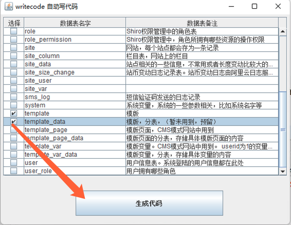

根据数据表自动写出实体类代码、增删查改。  
关于低代码开发-那些为了让技术少写代码而要花精力去学习另一款框架的，都是耍流氓！框架太多，如何跟得上！  

## 快速使用
#### 1. 加入maven依赖

````
<dependency>
	<groupId>com.xnx3.writecode</groupId>
	<artifactId>core</artifactId>
	<version>1.0</version>
	<scope>provided</scope>
<dependency>
````

#### 2. 增加java文件
你想在哪个包增加实体类，就在哪个包增加一个java文件: WriteCode.java ,其内容为

````
package com.xnx3.demo;

import com.xnx3.autowritecode.WriteCode;
import com.xnx3.autowritecode.interfaces.impl.Mysql;

/**
 * 最简单的入门使用
 * @author 管雷鸣
 */
public class WriteCode {
	public static void main(String[] args) {
		String host = "local.mysql.leimingyun.com";	//主机，可以填写域名或ip
		int port = 3306;			//端口号
		String databaseName = "wangmarket"; //数据表的名字
		String username = "root"; 	//数据库登录用户名
		String password = "111111";	//数据库登录密码
		
		WriteCode code = new WriteCode(new Mysql(host, port, databaseName, username, password));
		code.writeEntityCodeBySelectTableUI();
		
	}
}

````

将 host、port、databaseName、username、password 填上，然后直接运行即可看到下图。

#### 3. 选择数据表，进行生成对应的实体类
选择那几个表要进行生成，选择后点击生成按钮，即可生成。
 

## 目录结构

```
writecode                           项目
├─client                            子项目-桌面客户端运行软件，可打包成exe、dmg，在windows、mac系统中直接运行
├─core                              writecode的核心支持
├─datasource-mysql                  子项目-Mysql数据源的扩展实现
├─demo                              子项目-demo运行示例
├─else                              其他的杂七杂八相关文件
│  ├─images                         文档中的一些图片便是存在于此
│  └─tag.md                         变量标签的文档
├─template-springboot               子项目-针对SpringBoot的模板文件，如果你是springboot项目，可用此来一键生成实体类、controller等（待完善）
├─template-wm                       子项目-针对wm的模板文件，可自动生成wm框架的实体类、controller类、vo类、前端的列表页面、编辑页面等
├─pom.xml                           项目源代码 pom ( Maven )
└─README.md                         说明
```

## 更多使用
* 自定义生成实体类的模板 | [变量标签](else/tag.md)
* [在wm及网市场云建站系统中的深度集成使用](else/wm_demo.md)
* [其他数据库的扩展，如 SqlServer、Oracle 等](else/datasource.md)
