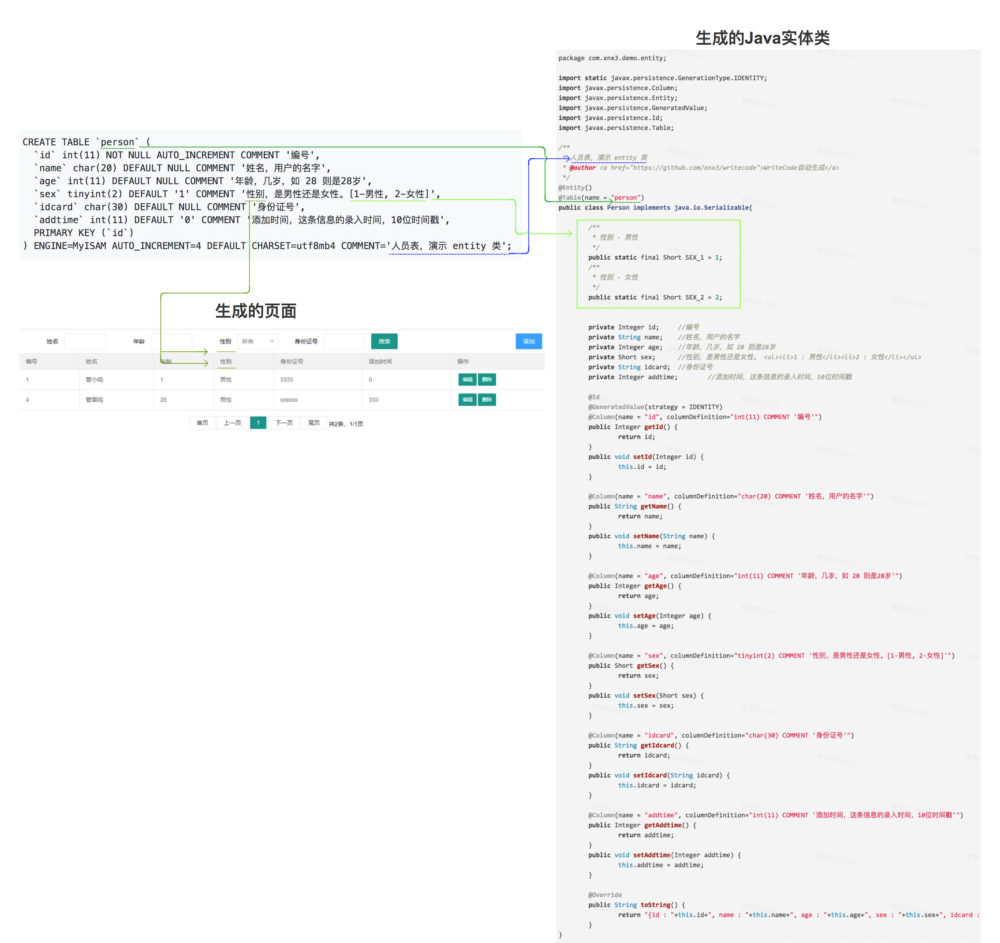
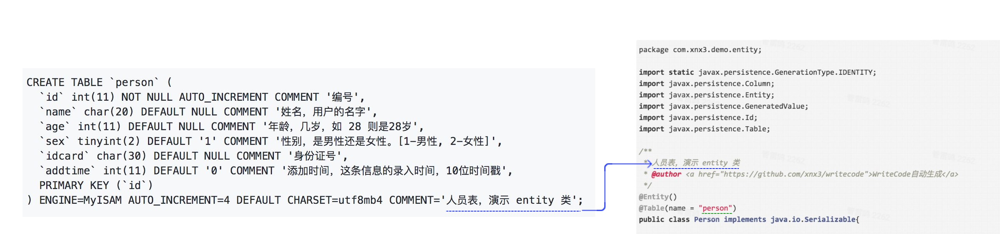
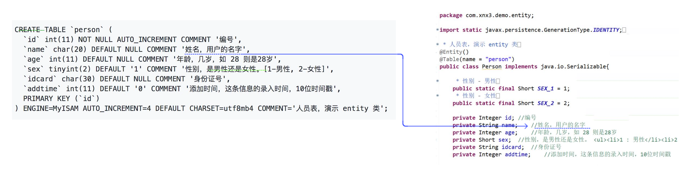
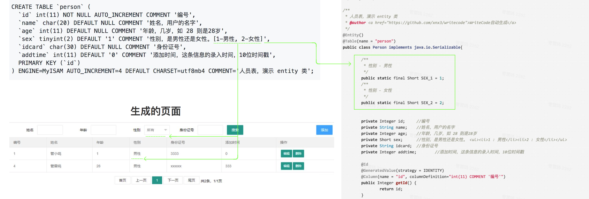
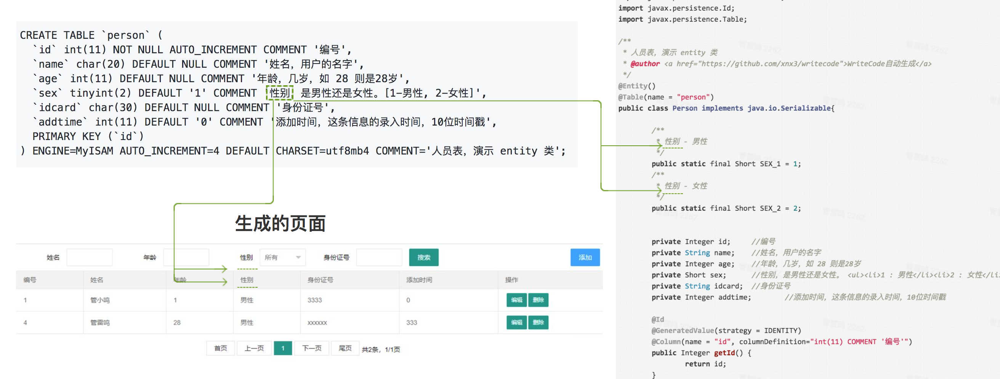

# 建立数据表DEMO示例 - 人员表 person

   
创建表的SQL语句：  

````
DROP TABLE IF EXISTS `person`;
CREATE TABLE `person` (
  `id` int(11) NOT NULL AUTO_INCREMENT COMMENT '编号',
  `name` char(20) DEFAULT NULL COMMENT '姓名，用户的名字',
  `age` int(11) DEFAULT NULL COMMENT '年龄，几岁，如 28 则是28岁',
  `sex` tinyint(2) DEFAULT '1' COMMENT '性别，是男性还是女性。[1-男性, 2-女性]',
  `idcard` char(30) DEFAULT NULL COMMENT '身份证号',
  `addtime` int(11) DEFAULT '0' COMMENT '添加时间，这条信息的录入时间，10位时间戳',
  PRIMARY KEY (`id`)
) ENGINE=MyISAM AUTO_INCREMENT=4 DEFAULT CHARSET=utf8mb4 COMMENT='人员表，演示 entity 类';
````


# 图解
 

# 说明

### 数据表的备注
  
数据表要给设置上备注说明 (COMMENT) ，说明这张表是干什么的。当自动创建实体类、Controller等时，这个注释便会变成他们的注释

### 字段的备注
  
数据表中的字段要设置上备注说明 (COMMENT)，说明这个字段是干什么的  

### 字段的常量 
   
比如性别 sex,它其实就是两个固定的值，1代表男性，2代表女性，这种存储固定常量标识的，可以再注释后面以 ```` [1-男性, 2-女性]```` 这种形式来标记。用 ```` [] ```` 包起来，其中每个标记中间以英文逗号分割。这样就能用 [tag标签](tag.md) 动态调用设置的常量信息了。 （当然了，如果你不加这个，也不影响正常使用。）  

### 备注的拆分
   
对于字段的备注，将简短说明跟详细说明中间以逗号分开（如果备注中出现了多个逗号，以第一个为准，其他的不作数，就只是个标点符号作用而已。）。  
比如上面 person表的sex 字段，其备注为 ```` 性别，是男性还是女性。[1-男性, 2-女性] ```` 便是拆分为两块，
* ```` 性别 ```` 
* ```` 是男性还是女性。[1-男性, 2-女性] ````  
  
如此，像是自动生成的搜索栏中的搜索项、列表的表头文字说明、编辑页面的编辑项标签，所出现的就都可以是简短说明所调出来的值 ```` 性别 ```` 

